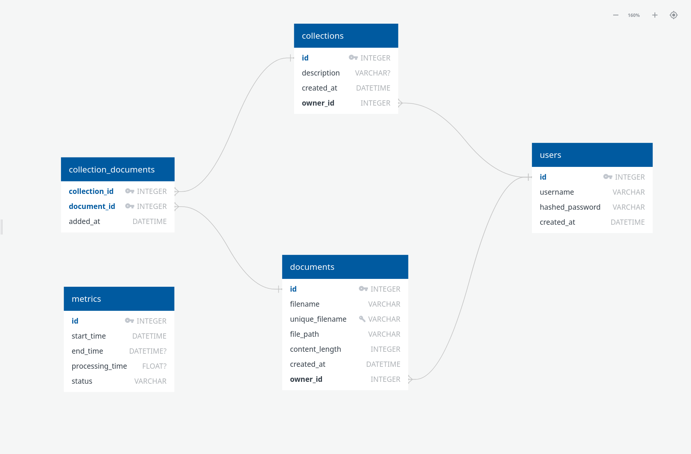

# Структура базы данных

## Диаграмма связей

## Описание таблиц

### Users
Таблица пользователей системы.

| Поле | Тип | Описание |
|------|-----|----------|
| id | int | Первичный ключ |
| username | string | Уникальное имя пользователя |
| hashed_password | string | Хешированный пароль |
| created_at | datetime | Дата создания |

### Documents
Таблица документов (загруженных текстовых файлов).

| Поле | Тип | Описание |
|------|-----|----------|
| id | int | Первичный ключ |
| filename | string | Оригинальное имя файла |
| unique_filename | string | Уникальное имя файла с временной меткой |
| file_path | string | Путь к сохраненному файлу |
| content | string | Текстовое содержимое документа |
| content_length | int | Длина содержимого |
| created_at | datetime | Дата создания |
| owner_id | int | Внешний ключ на таблицу users |

### Collections
Таблица коллекций документов.

| Поле | Тип | Описание |
|------|-----|----------|
| id | int | Первичный ключ |
| name | string | Название коллекции |
| description | string | Описание коллекции |
| created_at | datetime | Дата создания |
| owner_id | int | Внешний ключ на таблицу users |

### CollectionDocumentLink
Таблица связей между коллекциями и документами (многие-ко-многим).

| Поле | Тип | Описание |
|------|-----|----------|
| collection_id | int | Внешний ключ на таблицу collections |
| document_id | int | Внешний ключ на таблицу documents |
| added_at | datetime | Дата добавления документа в коллекцию |

### Metrics
Таблица метрик обработки.

| Поле | Тип | Описание |
|------|-----|----------|
| id | int | Первичный ключ |
| start_time | datetime | Время начала обработки |
| end_time | datetime | Время окончания обработки |
| processing_time | float | Время обработки в секундах |
| status | string | Статус обработки |
